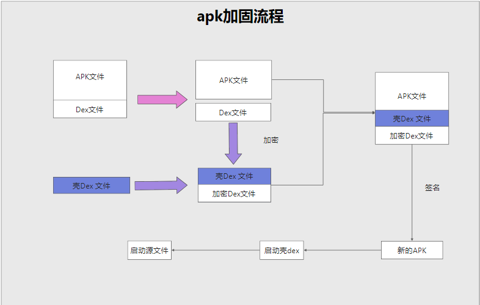
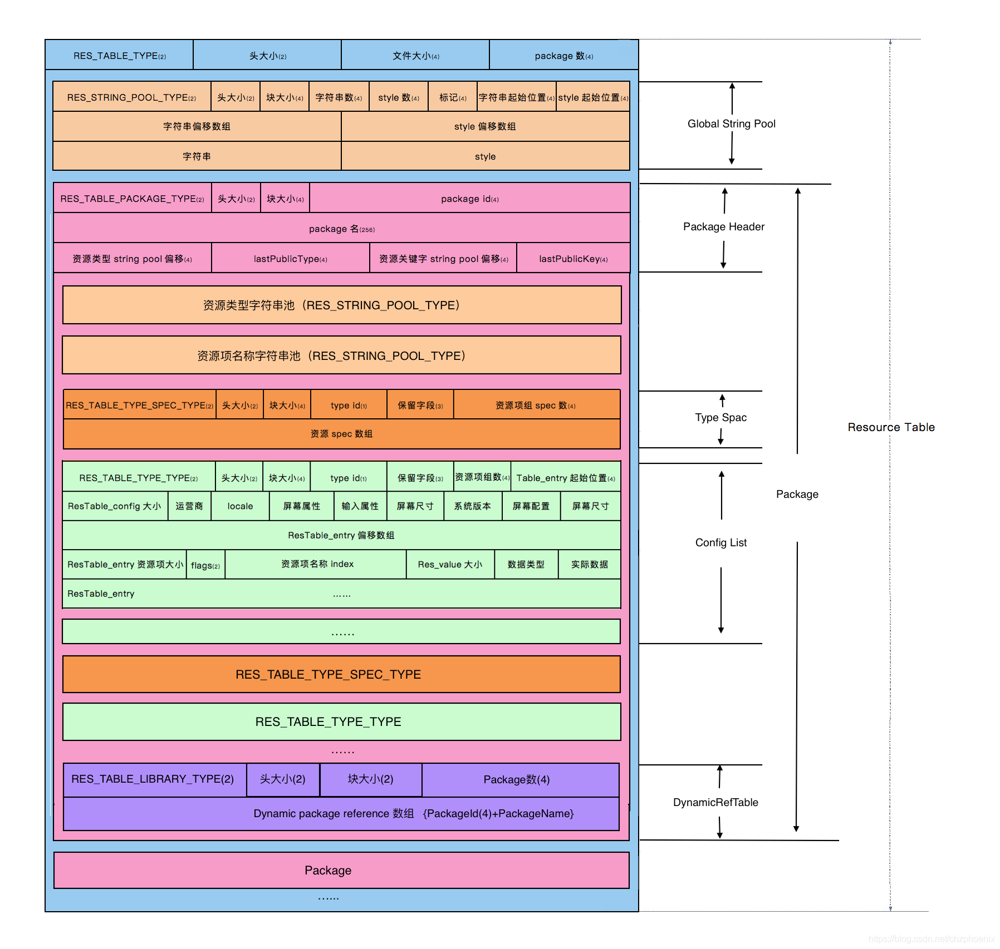

## 一、项目主要包含Dex加密和Res加密两大块

### 1.1 dex文件的加密

- dex文件的加密逻辑主要在Proxy_Guard_Tools模块的Main_Dex类中
- dex文件的解密逻辑主要在Proxy_Guard_Core模块的ProxyApplicationDex类中

### 1.2 res文件的加密

- res文件的加密逻辑主要在Proxy_Guard_Tools模块的Main_Res类中
- res文件的解密逻辑主要在Proxy_Guard_Core模块的ProxyApplicationRes类中

## 一、加固常见的方案和手段

- 反模拟器
- 虚拟机保护
- Dex文件加密

## 二、需要用到的原理

### 1.1 APK的打包，签名流程

### 1.2 Framework层Application的启动流程

### 1.3 Dex文件结构解析

### 1.4 Android中的类加载器

### 1.4 Dex文件的加载流程，ClassLoader类加载器的加载原理，如何让后

Dex文件默认是被PathClassLoader加载到内存中的，默认存储在PathClassLoader对象的DexFileList属性的Element数组中，
在我们使用DexClassLoader加载我们经过加密解密之后的Dex文件，我们需要把通过反射获取这个Element数组，
然后把新加载的Dex字节数组插入到Element数组的前面，这样类加载器在寻找对象的时候就会先获取我们插入的对象

### 1.5 Resource.arsc文件结构解析

了解Resource.arsc的结构，主要是为了资源加密的时候伪造明文resouce.arsc文件

### 1.6 Res资源文件的加载流程，Resource和AssetManager的加载原理

我们使用Resource通过资源id获取资源的时候，其本质是通过AssetManager来获取的，如此要想动态加载资源，我们其实有两个方向：

- 方案1 我们可以新创建一个AssetManager， 并通过反射调用其【addAssetPath】方法进行资源加载，然后再替换Resouce中原来的AssetManager对象
- 方案2 系统在创建AssetManager对象的时候，系统默认会加载LoadApk对象中的【mResDir】字段，我们可以通过反射修改这个字段

在我们新创建了Resouce对象之后，还需要找到Framework层中持有旧的Resouce引用的对象，把旧的Resouce对象的引用替换为新的

### 1.7 反射的使用，通过反射hook系统层类对象

我们需要在代理ProxyApplication的onCreate方法中替换我们真正的Application，并替换各个系统类对Application的引用

### 1.8 自定义加固和热修复的区别，热修复的原理，bisdiff算法产生差分包

目前资源加密只做了自定义AssetManager，并使用他成功进行了动态资源加载，但是目前的方案会导致很多兼容性问题，比如获取相册文件失败，
导致这些问题的原因主要是因为framework层存在着众多对象持有Resource和AssetManager的引用，我们要想真正实现实现动态加载资源，
就需要通过反射把这些对象里面关于Resouce的引用全部替换掉，具体可以参考腾讯的热修复开源框架Tinker